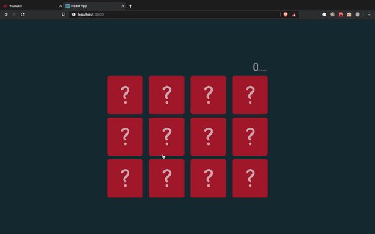

- Memory card matching game in React using React States and Effects.
- To run the project:
    - Clone or Download the repo.
    - Go to the folder directory.
    - Run `npm install`
    - Run react server `npm start`
